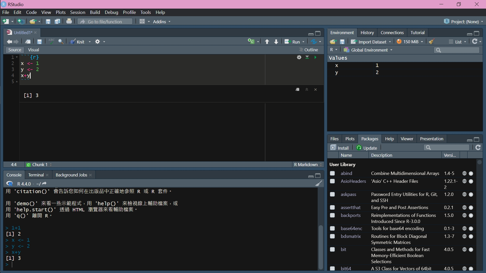

```{css echo = FALSE}
/*-- scss:defaults --*/

body{
  color:#7CA8BF;
  background-color:#ffe4e1;
  font-size: 16px;
}

a{
  color: #fbcac4;
}

/* width */
::-webkit-scrollbar {
    width: 10px;
    background-color:rgba(255, 192, 203, 0.183)
}

/* Track */
::-webkit-scrollbar-track {
    border-radius: 10px;
}

/* Handle */
::-webkit-scrollbar-thumb {
    border-radius: 10px;
    background-color: #7CA8BF;
}
/* Handle on hover */
::-webkit-scrollbar-thumb:hover {
    width: 40px;
    background-color: #fbcac4;
}

hr{
  border-top: 1px solid #bdcfda;
}

caption {
  display: table-caption;
  text-align: center;
  font-size: 16px;
}

.dataframe{
    width: 100%;
    height: 130px;
    border: 5px solid #bdcfda;
    border-collapse: collapse;
    font-size: 18px;
}

.dataframe tr, .dataframe tr td{
    border: 2px solid #bdcfda;
    align-items: center;
}

.dataframe tr th{
    border: 2px solid #bdcfda;
}

tbody{
  border: 5px solid #bdcfda;
}

.list-group-item.active, .list-group-item.active:focus, .list-group-item.active:hover {
    z-index: 2;
    color: #ffe4e1;
    background-color: #7CA8BF;
    border-color: #7CA8BF;
}

.code-output{
  color:#ffe4e1;
  background-color:#7CA8BF;
}

```

****

In this tutorial, we start with simple R code, and we then introduce basic statistics and probabilities. Utilizing R code and packages to learn statistics methods is the core of this webpage. (here's the [presentation](https://yihsinlu.github.io/2024R.io/presentation/RStat_tutorial.html))

* R

* Probability and Statistics

* Data with R

* Statistics with R

* Model with R

****

### **WHY?**

Why is it important to learn statistics, and why do we use R for data analysis? In the current era characterized by big data, extensive information, and artificial intelligence (AI), statistical models form the cornerstone of AI and machine learning. Statistics provide a comprehensive framework for explaining outcomes, parameters, and nearly all aspects of these models. By utilizing R, a powerful statistical computing language, researchers can efficiently analyze and interpret complex datasets, thereby advancing the field of data science.

****

# **1 R**

J.D. Long, P. Teetor ([2019](https://rc2e.com/)) present a R cookbook by bookdown. Start with [install R](https://cran.r-project.org/bin/windows/base/) and its compiler [R studio](https://posit.co/downloads/).

****

## **1.1 Get Start**

The R studio page display 4 windows unless nav-bar, The upper left window is the opening file, I prefer utilize .Rmd (R mark down). As FIG 1., we code between the area and see the result below. You also could type the code behind the `>` on lower left window, and click enter to run the code. Two right windows illustrate the variable, function, and packages, we will introduce how they work later.



****

## **1.2 Variables**

For the problem of using `<-` or `=`, we will see the same result for setting variables but my suggestion is `<-`.

``` {r class.output="code-output"}
x <- 100
x = 100
x
```

### **1.2.1 integer**

``` {r class.output="code-output"}
int <- 10
int
```

### **1.2.2 character**

``` {r class.output="code-output"}
chr <- "I am a character"
chr
```

### **1.2.3 vector**

Be careful the variable name, such as c is a function fro creating vectors.

``` {r class.output="code-output"}
V1 <- c(1:10)
V2 <- c("2", 2)
V1
V2
```

### **1.2.4 function**

$$
f(x)=x^2+2x+1\text{, and find } f(\pi).
$$

``` {r class.output="code-output"}
f <- function(x){ x^2+2*x+1 }
f(pi)
```

Using `?function_name` to see detail in th function.

### **1.2.5 factor**

``` {r class.output="code-output"}
F1 <- factor(c(1,0,1,1,0,1))
F1
```

### **1.2.6 list**

``` {r class.output="code-output"}
List1 <- list(integer1 = int,
              character1 = chr,
              vector1 = V1,
              function1 = f,
              factor1 = F1)

List1
```

### **1.2.7 matrix**

``` {r class.output="code-output"}
M1 <- matrix(c(1,2,1,
               0,2,7),
             ncol = 3,nrow = 2,byrow = T)
M1
```

``` {r class.output="code-output"}
M2 <- matrix(c(1,0,0,
               0,1,0,
               0,0,1), ncol = 3, nrow = 3, byrow = T)
M2
```

``` {r class.output="code-output"}
M1%*%M2
```

### **1.2.8 data frame**

``` {r class.output="code-output"}
df <- data.frame(Name = c("Sam", "Yuji", "Lan", "Elaine"),
                 Age = c(28,24,NA,NA),
                 Height = c(177, 187, 159, 164),
                 Gender = factor(c("M", "M", "F", "F")))
df
```

****

## **1.3 Loop**

When you repeat the same things many times.

### **1.3.1 for**

```{r class.output="code-output"}
buliding <- c()

for(Floor in 1:101){
  buliding <- rbind(Floor, buliding)
}

buliding
```

****

# **2 Probabilities and Statistics**

[Textbook](https://cis.temple.edu/~latecki/Courses/CIS2033-Spring13/Modern_intro_probability_statistics_Dekking05.pdf)

****

## **2.1 Probability Space**

$$
\Large (\Omega, \mathscr{F}, P)
$$

* $\Omega$: Sample space, all of the occurring events.

* $\mathscr{F}$: $\sigma$-algebra, hard to explained, simply define $\Omega\in\mathscr{F}$, fixed the math.

* $P$: probability measure, the value of the occurring event, and between 0 and 1.

****

### **2.1.1 simply example**

Probability space of tossing a fair coin, then:

* $\Omega = \{H,T\}$

* $\mathscr{F} = \{H,T\}$

* $P(\{H\})=P(\{T\})=\frac{1}{2}$

### **2.1.2 Probability Measure**

* Three Axiom

  + $0\leq P(A)\leq 1,\;\forall A$

  + $P(\Omega) = 1$

  + $P(\bigcup_{i=1}^n A_i)=\sum_{i=1}^n P(A_i), \text{where }A_i\cap A_j=\varnothing,\;\forall i,j$

****

## **2.2 Discrete Random Variable**

* Use X,Y,Z,... define random variables, and x,y,z,.. define values.

* Random Variables $X$ includes all possible outcomes.

* Probability is denoted by $P(X=x)=f(x)$.

* Mean: $E(X) = \sum_{x=1}^nx_if(x) = \mu$

* variance:$Var(X) = \sum_{x=1}^n(x-\mu)^2f(x)= E(X-E(X))^2=E(X^2)-(E(X))^2$

****

### **2.2.1 Binomial**

$$
\Large X\sim B(n,p)
$$

* $n$ and $p$ are parameters of distribution

* $n$: n times for trail

* $p$: probability of event for each trail

* Probability Mass Function (pmf):

$$
f_X(x) = \binom{n}{x}\;p^xq^{n-x},\;\forall x = 1, \cdots, n
$$

****

## **2.3 Continuous Random Variable**

* Probability is denoted by $P(X\leq x)=\int_{-\infty}^xf(x)dx$, then $P(X=x)=0$

* Mean: $E(X) = \int_\mathbb {r class.output="code-output"}xf_X(x)dx = \mu$

* variance:$Var(X) = \int_\mathbb {r class.output="code-output"}(x-\mu)^2f_X(x)dx = E(X-E(X))^2=E(X^2)-(E(X))^2$

****

### **2.3.1 Exponential**

* $X\sim\exp(\lambda)$

* Probability Density Function (pdf.) $f_X(x) = \lambda e^{-\lambda x}$

``` {r class.output="code-output"}
f <- function(x, lambda = 1){lambda*exp(-lambda*x)}
curve(f,from = 0, to = 5, col = 1)
curve(f(x,2),from = 0, to = 5, col = 2, add = TRUE)
curve(f(x,.5),from = 0, to = 5, col = 3, add = TRUE)
```

****

### **2.3.2 Normal**

$$
\Large X\sim N(\mu, \sigma^2)
$$

$$
f_X(x) = \cfrac{1}{\sqrt{2\pi}\sigma}e^{-\frac{(x-\mu)^2}{2\sigma^2}},\;\forall\;x\in\mathbb``` {r class.output="code-output"}
$$

****

### **2.3.3 t-distribution**

* $X\sim t_n$

* $t_n\overset{d}{=}\color {r class.output="code-output"ed}{N(0,1)}\;$ as $\;n\rightarrow\infty$

``` {r class.output="code-output"}
curve(dt(x,df=1),from=-4,to=4,col="#000000",ylim=c(0,0.4))
curve(dt(x,df=2),from=-4,to=4,col="#240000",add=T)
curve(dt(x,df=3),from=-4,to=4,col="#460000",add=T)
curve(dt(x,df=4),from=-4,to=4,col="#690000",add=T)
curve(dt(x,df=5),from=-4,to=4,col="#800000",add=T)
curve(dt(x,df=8),from=-4,to=4,col="#990000",add=T)
curve(dt(x,df=10),from=-4,to=4,col="#bb0000",add=T)
curve(dt(x,df=50),from=-4,to=4,col="#cc0000",add=T)
curve(dt(x,df=91),from=-4,to=4,col="#dd0000",add=T)
curve(dt(x,df=100),from=-4,to=4,col="#ee0000",add=T)
curve(dnorm(x,0,1),from=-4,to=4,col="#ff0000",add=T)
```

****

# **3 Data with R**

****

## **3.1 Random Sample**

$$
\mathcal{X}=(X_1, X_2,\cdots, X_{100}),\;\forall\;X_i\overset{iid}{\sim} N(160,10)
$$

``` {r class.output="code-output"}
set.seed(19970608)
#random
x <- rnorm(n = 100, mean = 160, sd = sqrt(10))
sort(x, decreasing = FALSE)
```

****

## **3.2 Histogram**

``` {r class.output="code-output"}
hist(x, nclass = 20)
```

****

## **3.3 Data table**

``` {r class.output="code-output"}
library(kableExtra)
df <- read.csv(file = "csv/df.csv", fileEncoding = "Big5")
kable(df)
```

****

## **3.4 New Data (Male)**

``` {r class.output="code-output"}
library(randomNames)
set.seed(19970608)
New_df.M <- data.frame(Name = randomNames(n = 68, gender = 0, which.names = "first"),
                       Height = rnorm(68, 175, 10),
                       Weight = rnorm(68, 70, 10),
                       Gender = rep("M", 68),
                       Age = sample(20:40, size = 68, replace = TRUE))
New_df.M
```

****

## **3.5 New Data (Female)**

``` {r class.output="code-output"}
library(randomNames)
set.seed(19970607)
New_df.F <- data.frame(Name = randomNames(n = 28, gender = 1, which.names = "first"),
                       Height = rnorm(28, 160, 10),
                       Weight = rnorm(28, 50, 10),
                       Gender = rep("F", 28),
                       Age = sample(20:40, size = 28, replace = TRUE))
New_df.F
```

****

## **3.6 New Data (n = 100)**

``` {r class.output="code-output"}
New_df <- rbind(df, New_df.M, New_df.F) #cbind()
New_df
```

****

## **3.7 Data editing**

``` {r class.output="code-output"}
library(dplyr)
New_df <- New_df%>%
  mutate(BMI = Weight/(Height/100)^2)%>%
  transform(Gender = as.factor(Gender),
            BMI = round(BMI, digits = 1))
New_df
```

****

## **3.8 Data Information**

``` {r class.output="code-output"}
summary(New_df)
```

****

## **3.9 Data searching**

``` {r class.output="code-output"}
New_df%>%filter(BMI<13)
```

``` {r class.output="code-output"}
New_df%>%filter(Height>190)
```

``` {r class.output="code-output"}
New_df%>%filter(Age==28)
```

****

# **4 Statistics with R**

****

## **4.1 One-sample Student's t Test**

$$
H_0: \mu=170
$$

$$
H_1: \mu\neq 170
$$

``` {r class.output="code-output"}
t.test(New_df$Height, mu=170)
```

****

## **4.2 One-sample Student's t Test**

$$
H_0: \mu>170
$$

$$
H_1: \mu\leq 170
$$

``` {r class.output="code-output"}
t.test(New_df$Height, mu=170, alternative = "greater") #alternative = "less", when H_0:\mu<170
```

****

## **4.3 Two-sample Student's t Test**

$$
H_0: \mu_1<\mu_2
$$

$$
H_1: \mu_1\geq\mu_2
$$

``` {r class.output="code-output"}
BMI_M <- New_df%>%filter(Gender=="M")
BMI_M <- sample(BMI_M$BMI, 30, replace = F)
BMI_F <- New_df%>%filter(Gender=="F")
BMI_F <- BMI_F$BMI 

#test
t.test(BMI_M, BMI_F, alternative = "less")
```

****

# **5 Model with R**

****

## **5.1 Linear Model**

$$
Y = \beta_0+\beta_1X+\varepsilon\;,\;\text{where }\;\varepsilon\sim N(0,1)
$$

``` {r class.output="code-output"}
glm1 <- glm(Height~Weight, data = New_df)
summary(glm1)
```

****

## **5.2 Regression Plot**

``` {r class.output="code-output", warning=FALSE, message=FALSE}
library(plotly)


est_beta <- glm1$coefficients
New_est <- data.frame(Height = est_beta[1]+est_beta[2]*New_df$Weight,
                      Weight = New_df$Weight)

plot_ly(New_df, x = ~Weight,
        y = ~Height,
        text = New_df$Name,
        type = 'scatter',
        alpha = 0.65,
        mode = 'markers',
        name = 'Weight-Height')%>%
  add_trace(data = New_est,
            x = ~Weight,
            y = ~Height,
            name = 'Regression Fit',
            mode = 'lines')
```


****

## **5.3 Regression Plot (Gender)**

``` {r class.output="code-output", warning=FALSE, message=FALSE}
library(plotly)

est_beta <- glm1$coefficients
New_est <- data.frame(Height = est_beta[1]+est_beta[2]*New_df$Weight,
                      Weight = New_df$Weight)

plot_ly(New_df,
        x = ~Weight,
        y = ~Height,
        text = New_df$Name,
        color = ~New_df$Gender,
        type = 'scatter',
        alpha = 0.65, mode = 'markers',
        name = 'Weight-Height')%>%
  add_trace(data = New_est,
            x = ~Weight,
            y = ~Height,
            name = 'Regression Fit',
            mode = 'lines')
```

****

## **5.4 Regression Plot (Age)**

``` {r class.output="code-output", warning=FALSE, message=FALSE}
library(plotly)

est_beta <- glm1$coefficients
New_est <- data.frame(Height = est_beta[1]+est_beta[2]*New_df$Weight,
                      Weight = New_df$Weight)

plot_ly(New_df, x = ~Weight,
        y = ~Height,
        text = New_df$Name,
        color = ~New_df$Age,
        type = 'scatter',
        alpha = 0.65,
        mode = 'markers',
        name = 'Weight-Height')%>%
  add_trace(data = New_est,
            x = ~Weight,
            y = ~Height,
            name = 'Regression Fit',
            mode = 'lines')
```

****

## **5.5 Statistical meaning**

* Model: $Y=X\beta+\varepsilon$, for $\varepsilon\sim N(0,1)$

* Estimate $\beta_0$, $\beta_1$

$$
Y = \begin{pmatrix}
Y_1\\
\vdots\\
Y_n
\end{pmatrix}
,\;
X = \begin{pmatrix}
1 & X_1\\
\vdots & \vdots\\
1 & X_n
\end{pmatrix}
,\;\text{and }\;
\beta = \begin{pmatrix}
\beta_0\\
\beta_1
\end{pmatrix}
$$

* $\hat{\beta} = \begin{pmatrix} \hat{\beta_0}\\ \hat{\beta_1} \end{pmatrix}$ is LSE of $\beta$

****

### **5.5.1 LSE**

* LSE (Least Squared Estimation) to estimate $\beta$

* Estimation of $Y$: $\hat{Y}=X\hat{\beta}$

* Minimized:

$$
(Y-X\hat{\beta})^T(Y-X\hat{\beta})
$$

* Solve: (maximum and minimum for the function while the derivative equal to 0.)

$$
\cfrac{\partial}{\partial\hat{\beta}} (Y-X\hat{\beta})^T(Y-X\hat{\beta})=0
$$

* We have:

$$
\hat{\beta} = (X^TX)^{-1}X^TY
$$


****

# **6 QA**

****

## **6.1 ERROR**

****

### 6.1.1 error: can not find the object 'x'

Here's the problem for undefined variable 'x'.

****
### 6.6.2 error: the function 'f' not found.

Check the function exists or the package with this function should be installed. Please use `?f` to find the function detail. If you use the function `f` in package called `Basic`, then install the package and run the code `library("Basic")`. You then use the function.

****
### 6.6.3 wrong data type

Sometimes, the package require numeric only, you could use `as.numeric()` to change its type and utilize `class()` to check its type.

```{r class.output="code-output"}
c1 <- c(1,2,5,7,"1","6")

# turn into numeric
c1 <- as.numeric(c1)

#check
class(c1)
```

****
